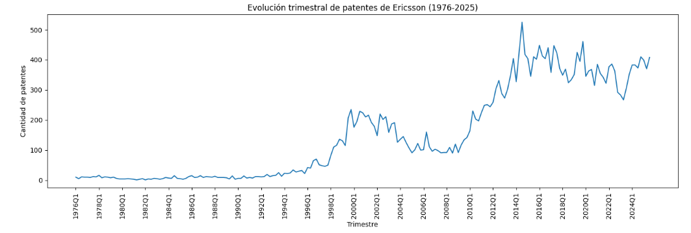

# 📡 Ericsson Patent Evolution — Análisis Multi-Herramienta


Análisis exploratorio, estadístico y predictivo del dataset **Ericsson Innovation Timeline: Patent Evolution** (30,118 patentes, 1976-2025), implementado con 6 herramientas distintas para comparar enfoques y validar hallazgos de forma cruzada.

## Objetivo

Explorar la evolución histórica de la innovación tecnológica de Ericsson a través de sus patentes, identificar tendencias tecnológicas clave (5G, AI/ML, IoT, Cloud), y comparar distintos enfoques de forecasting (estadístico clásico vs. Machine Learning) para predecir el volumen de patentes futuras.

## 🗂️ Dataset

- **Fuente**: Ericsson Innovation Timeline: Patent Evolution (Kaggle)
- **Tamaño**: 30,118 patentes individuales | 199 trimestres (1976-2025)
- **Columnas**: 55 features originales, incluyendo metadata, keywords tecnológicos, y features de series de tiempo (lags, rolling means, growth rates)

---

## 🐍 1. Python — Limpieza, EDA y Machine Learning

**Qué se hizo:**
- **Limpieza**: se corrigieron tipos de datos (fechas, categorías) y se separó el dataset original de 55 columnas en dos niveles: `patent_level` (30,118 filas, atributos por patente individual) y `quarterly_level` (199 filas, estadísticas agregadas por trimestre). Se documentaron 408 valores nulos en el target, confirmados como estructurales (último trimestre sin "trimestre siguiente" conocido), no como error de datos.
- **EDA**: 6 visualizaciones explorando evolución temporal, estacionalidad, tendencias tecnológicas, distribución por tipo de patente, correlación entre keywords, y complejidad de títulos por era.
- **Modelado ML**: se entrenaron modelos Ridge y Random Forest para predecir `target_patent_count_next_quarter`, con validación respetando el orden temporal (80% train / 20% test, sin mezclar aleatoriamente).

**Qué se concluyó:**
- La innovación de Ericsson muestra **dos ciclos de boom** (≈2000 y ≈2012-2025) separados por un estancamiento (2004-2010), coincidiendo con las revoluciones de 2G/3G y 4G/5G/smartphones.
- **No hay estacionalidad relevante** dentro del año — la actividad de patentamiento es constante trimestre a trimestre.
- **Cloud/Edge lideró la adopción temprana** (~2000), mientras que 5G, AI/ML e IoT explotaron después de 2020.
- Existe un **cluster de tecnologías de infraestructura correlacionadas** (network/energy/antenna/data), mientras que **AI/ML tiene una trayectoria más independiente**.
- **Predecir el nivel absoluto de patentes fracasó** (R² negativo) por un cambio de régimen entre train (valores bajos, media 96.5) y test (valores altos, media 371.5), forzando a los modelos a extrapolar fuera de rango. Al reformular el problema como predicción del **cambio** (`delta`) en vez del nivel, Random Forest mejoró sustancialmente, aunque **ningún modelo de ML superó al ARIMA de R** (ver sección de R).

<table>
<tr>
<td></td>
<td></td>
</tr>
<tr>
<td align="center"><em>Evolución histórica: dos ciclos de innovación</em></td>
<td align="center"><em>Despegue de 5G, AI/ML, IoT y Cloud</em></td>
</tr>
<tr>
<td></td>
<td></td>
</tr>
<tr>
<td align="center"><em>Correlación entre tecnologías</em></td>
<td align="center"><em>Comparación Real vs. Ridge vs. Random Forest</em></td>
</tr>
</table>

## 📈 2. R — Series de Tiempo y ARIMA

**Qué se hizo:**
- **Descomposición STL** de la serie `patent_count` trimestral, separándola en tendencia, estacionalidad y residuo.
- **Tests de estacionariedad** (ADF y KPSS) sobre la serie original y diferenciada.
- **Modelo ARIMA automático** (`auto.arima()`), y **forecast** a 8 trimestres (2 años) hacia adelante.

**Qué se concluyó:**
- La componente estacional tiene una amplitud pequeña frente al rango total de la serie, **confirmando estadísticamente** la ausencia de estacionalidad relevante ya vista en Python.
- La serie **no es estacionaria** en su forma original (ADF p=0.47, KPSS p<0.05), pero **sí lo es tras una diferenciación** (d=1, ADF p=0.01).
- El mejor modelo encontrado fue **ARIMA(0,1,1) con drift**: sin componente estacional (confirmando de nuevo su irrelevancia) y con una tendencia de crecimiento sostenido (~1.98 patentes/trimestre).
- El forecast proyecta continuidad del ritmo actual (~400-415 patentes/trimestre) para 2025-2027, con intervalos de confianza que se amplían con el horizonte.
- **Este modelo (RMSE=29.05) superó tanto al baseline naive (RMSE=43.93) como a los modelos de ML de Python**, siendo el mejor predictor de todo el proyecto — un hallazgo relevante: para series con tendencia fuerte y pocas observaciones, un modelo estadístico especializado puede superar a enfoques de ML genéricos.

<table>
<tr>
<td></td>
<td></td>
</tr>
<tr>
<td align="center"><em>Descomposición STL: tendencia domina sobre estacionalidad</em></td>
<td align="center"><em>Forecast ARIMA a 8 trimestres</em></td>
</tr>
</table>

## 🗄️ 3. SQL — Validación y Consultas

**Qué se hizo:**
- Consultas de conteo y verificación de integridad sobre ambas tablas (`patent_level`, `quarterly_level`).
- Agregaciones con `GROUP BY` (total de patentes y promedio de `keyword_score` por `tech_era`).
- Un `JOIN` entre ambas tablas para cruzar tipo de patente con era tecnológica.

**Qué se concluyó:**
- Todos los totales agregados en SQL **coinciden exactamente** con los del EDA en Python (30,118 patentes, mismos totales por era), validando que la separación de datos no perdió ni duplicó información.
- El pico histórico de innovación (**2014 Q3, 525 patentes**) se confirmó de forma cruzada entre Python, R y SQL.
- Esta etapa **corrigió un error propio**: la escala del `keyword_score` reportada inicialmente en la interpretación del boxplot de Python (leída como 0-10) en realidad es **0-1** (0.42 a 0.67 entre eras) — el cálculo exacto de SQL detectó y corrigió esta lectura visual imprecisa.
- La dominancia de patentes tipo "utility" (~99%) es **constante en todas las eras tecnológicas**, no un efecto de un período específico.

<p align="center">

<br><em>JOIN entre patent_level y quarterly_level: distribución por era y tipo</em>
</p>

## 📊 4. Excel — Tablas Dinámicas

**Qué se hizo:**
- Importación del dataset trimestral, con corrección de un problema de configuración regional (Excel interpretaba el separador decimal en punto de los datos de Python como separador de miles).
- Dos tablas dinámicas: total de `patent_count` por `tech_era`, y promedio de `avg_keyword_score` por `tech_era`.

**Qué se concluyó:**
- Ambas tablas dinámicas **replican exactamente** los valores ya validados en SQL y Python, agregando una tercera confirmación cruzada independiente.
- El ejercicio evidenció un problema técnico real y común al trabajar con datos generados en Python e importados a Excel en configuraciones regionales distintas (punto vs. coma decimal), resuelto ajustando el tipo de columna vía Power Query con configuración regional explícita ("Inglés Estados Unidos").

<table>
<tr>
<td></td>
<td></td>
</tr>
<tr>
<td align="center"><em>Total de patentes por era tecnológica</em></td>
<td align="center"><em>Score promedio de keywords por era</em></td>
</tr>
</table>

## 📉 5. Power BI — Dashboard de Tendencias Tecnológicas

**Qué se hizo:**
- Modelo de datos con relación entre `patent_level` y `quarterly_level` (clave compuesta `year` + `quarter`).
- Dashboard con 4 visuales: evolución histórica de `patent_count`, evolución de keywords tecnológicos (5G/AI/ML/IoT/Cloud), KPIs (total de patentes y score promedio), y barras por `tech_era`.
- Dos segmentaciones de datos (slicers) interactivas: por `tech_era` y por rango de `year`.

**Qué se concluyó:**
- El dashboard permite **explorar interactivamente** los mismos hallazgos del EDA de Python (los dos booms, el despegue de AI/ML) filtrando dinámicamente por era o año, algo que un notebook estático no ofrece.
- Se validó que la interactividad entre visuales funciona correctamente: al filtrar por una `tech_era`, todos los gráficos (incluyendo los KPIs) se actualizan en conjunto.

<p align="center">

</p>

## 🔮 6. Tableau — Dashboard de Forecasting

**Qué se hizo:**
- Conexión y relación entre ambas tablas (con corrección de separador de campo CSV y configuración regional, replicando problemas similares a los de Excel/Power BI).
- Gráfico de evolución histórica con el **pronóstico nativo de Tableau** (suavizado exponencial) activado sobre la serie completa 1976-2025.
- Dos KPIs (total de patentes, score promedio de keywords) y filtro interactivo por `tech_era`.

**Qué se concluyó:**
- El pronóstico nativo de Tableau proyecta una **tendencia más agresiva y creciente** hacia 2033, en contraste con la proyección más conservadora y estable del ARIMA de R (~400-415/trimestre).
- Esta diferencia es un **hallazgo válido en sí mismo**: dos métodos de forecasting distintos (suavizado exponencial vs. ARIMA) llevan a conclusiones diferentes sobre el futuro, ilustrando que ningún método de pronóstico es una "verdad absoluta" y que la elección de metodología importa tanto como los datos mismos.

<p align="center">

</p>

---
## 📊 Hallazgos principales del proyecto


1. **Dos ciclos de innovación**: la actividad de patentamiento no fue lineal. Se identifican dos "booms" (≈2000 y ≈2012-2025) separados por un período de estancamiento (2004-2010).
2. **Sin estacionalidad relevante**: confirmado de forma consistente en Python (visual) y R (estadística formal, STL y ARIMA sin componente estacional).
3. **Explosión tecnológica reciente**: Cloud/Edge lideró la adopción temprana; 5G, AI/ML e IoT explotaron después de 2020.
4. **ARIMA superó a los modelos de ML genéricos**: el modelo ARIMA(0,1,1) con drift (R) tuvo mejor desempeño (RMSE=29.05) que Ridge y Random Forest (Python), incluso tras corregir un problema de extrapolación reformulando el target.
5. **Validación cruzada exitosa**: los totales agregados coinciden exactamente entre Python, SQL, Excel y Power BI, confirmando la integridad del pipeline de datos — y en el proceso se detectó y corrigió un error propio de interpretación de escala.
6. **El método de forecasting importa**: Tableau (suavizado exponencial) y R (ARIMA) proyectan futuros distintos para la misma serie, evidenciando que la elección de metodología estadística afecta directamente las conclusiones de negocio.

##  Herramientas y rol de cada una

| Herramienta | Rol en el proyecto | Carpeta |
|---|---|---|
| **Python** | Limpieza de datos, EDA (6 visualizaciones), Modelado ML (Ridge + Random Forest) | `/notebooks`, `/scripts` |
| **R** | Análisis estadístico formal de series de tiempo: descomposición STL, tests de estacionariedad, modelo ARIMA | `/R` |
| **SQL** | Consultas de validación y agregación sobre los datos limpios (SQLite) | `/sql` |
| **Excel** | Tablas dinámicas para vista ejecutiva rápida | `/excel` |
| **Power BI** | Dashboard interactivo de tendencias tecnológicas | `/powerbi` |
| **Tableau** | Dashboard de forecasting con pronóstico nativo | `/tableau` |

## 📁 Estructura del repositorio

```
├── data/
│   ├── raw/                        # Dataset original
│   └── processed/                  # Datasets limpios (patent_level, quarterly_level)
├── notebooks/                      # Jupyter Notebooks (limpieza, EDA, ML)
├── R/                               # Script de series de tiempo y ARIMA
├── sql/                             # Base de datos SQLite y queries documentadas
├── excel/                           # Archivo con tablas dinámicas
├── powerbi/                         # Dashboard .pbix
├── tableau/                         # Dashboard .twb
└── screenshots/                     # Capturas de resultados clave, organizadas por herramienta
```

##  Cómo reproducir este análisis

1. Clona este repositorio
2. Los notebooks de Python requieren: `pandas`, `numpy`, `matplotlib`, `seaborn`, `scikit-learn`
3. El script de R requiere: `tidyverse`, `tseries`, `forecast`, `lubridate`
4. Los dashboards de Power BI/Tableau se abren directamente con sus respectivos programas (Power BI Desktop / Tableau Desktop)

## 👤 Autor

**Francesco Alonso Salazar Franco**
