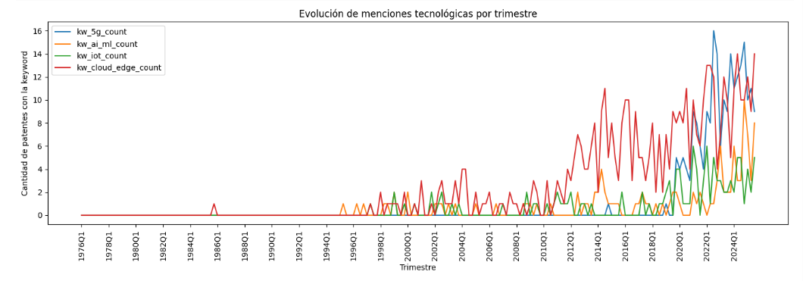
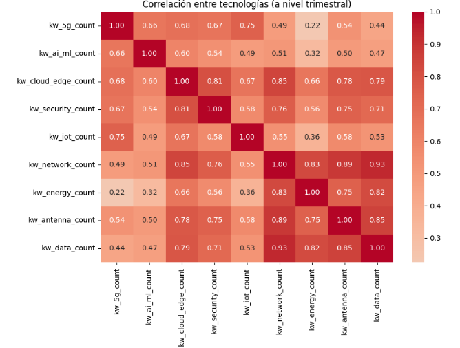
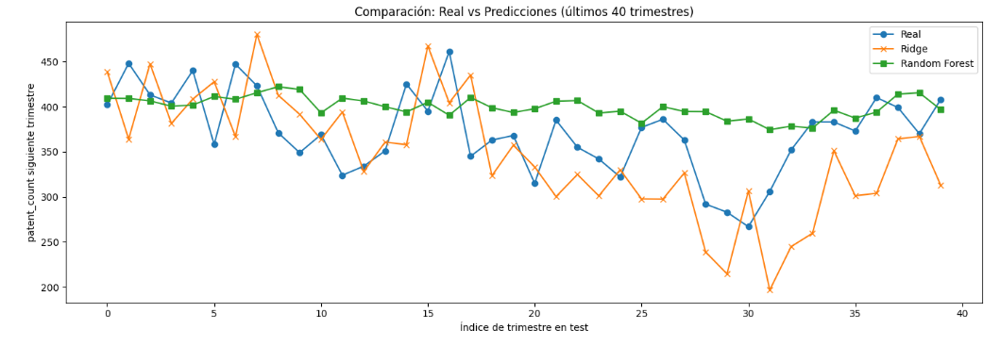
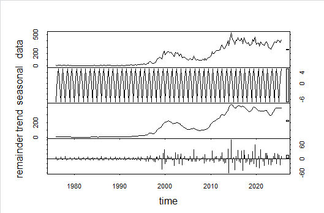
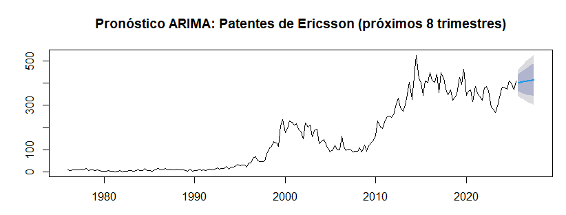
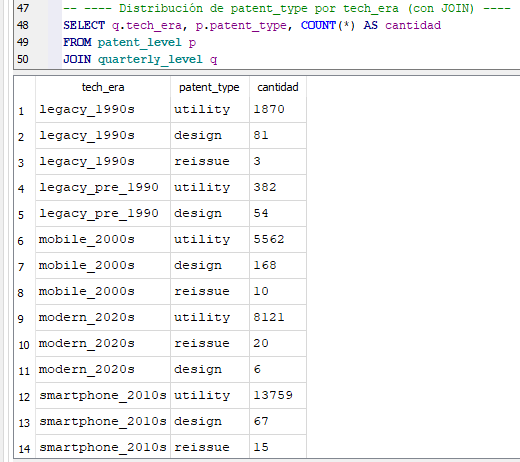
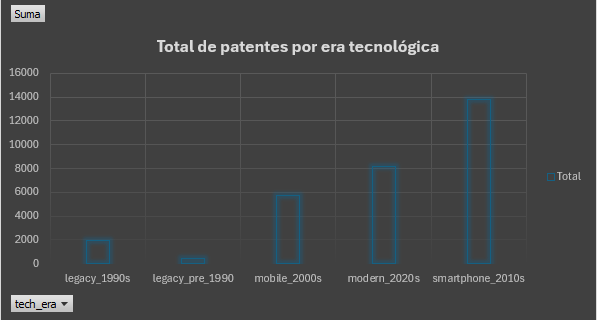
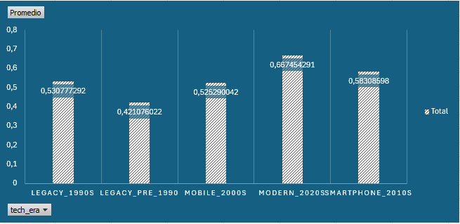
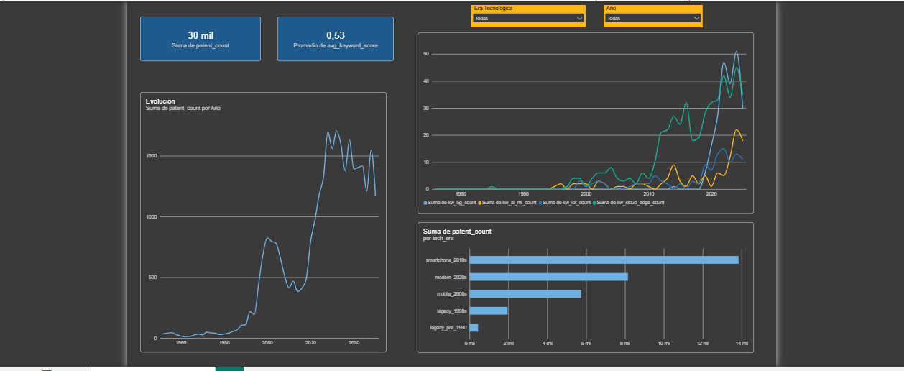
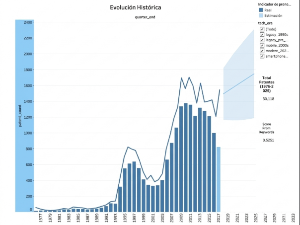

# 📡 Ericsson Patent Evolution — Análisis Multi-Herramienta


Análisis exploratorio, estadístico y predictivo del dataset **Ericsson Innovation Timeline: Patent Evolution** (30,118 patentes, 1976-2025), implementado con 6 herramientas distintas para comparar enfoques y validar hallazgos de forma cruzada.

## 🎯 Objetivo

Explorar la evolución histórica de la innovación tecnológica de Ericsson a través de sus patentes, identificar tendencias tecnológicas clave (5G, AI/ML, IoT, Cloud), y comparar distintos enfoques de forecasting (estadístico clásico vs. Machine Learning) para predecir el volumen de patentes futuras.

## 🗂️ Dataset

- **Fuente**: Ericsson Innovation Timeline: Patent Evolution (Kaggle)
- **Tamaño**: 30,118 patentes individuales | 199 trimestres (1976-2025)
- **Columnas**: 55 features originales, incluyendo metadata, keywords tecnológicos, y features de series de tiempo (lags, rolling means, growth rates)

---

## 🐍 1. Python — Limpieza, EDA y Machine Learning

Limpieza de datos, separación en niveles (patente/trimestre), 6 visualizaciones exploratorias, y modelado predictivo (Ridge + Random Forest).

<table>
<tr>
<td></td>
<td></td>
</tr>
<tr>
<td align="center"><em>Evolución histórica: dos ciclos de innovación</em></td>
<td align="center"><em>Despegue de 5G, AI/ML, IoT y Cloud</em></td>
</tr>
<tr>
<td></td>
<td></td>
</tr>
<tr>
<td align="center"><em>Correlación entre tecnologías</em></td>
<td align="center"><em>Comparación Real vs. Ridge vs. Random Forest</em></td>
</tr>
</table>

## 📈 2. R — Series de Tiempo y ARIMA

Descomposición estacional (STL), tests de estacionariedad (ADF/KPSS), y modelo ARIMA(0,1,1) con drift, usado como benchmark estadístico contra los modelos de ML.

<table>
<tr>
<td></td>
<td></td>
</tr>
<tr>
<td align="center"><em>Descomposición STL: tendencia domina sobre estacionalidad</em></td>
<td align="center"><em>Forecast ARIMA a 8 trimestres</em></td>
</tr>
</table>

## 🗄️ 3. SQL — Validación y Consultas

Consultas de agregación y JOIN sobre los datasets limpios, usadas para validar de forma cruzada los hallazgos del EDA en Python.

<p align="center">

<br><em>JOIN entre patent_level y quarterly_level: distribución por era y tipo</em>
</p>

## 📊 4. Excel — Tablas Dinámicas

Vista ejecutiva rápida mediante tablas dinámicas, validando los mismos totales obtenidos en SQL y Python.

<table>
<tr>
<td></td>
<td></td>
</tr>
<tr>
<td align="center"><em>Total de patentes por era tecnológica</em></td>
<td align="center"><em>Score promedio de keywords por era</em></td>
</tr>
</table>

## 📉 5. Power BI — Dashboard de Tendencias Tecnológicas

Dashboard interactivo con filtros dinámicos (era tecnológica, rango de años), mostrando la evolución de patentes y tecnologías clave.

<p align="center">

</p>

## 🔮 6. Tableau — Dashboard de Forecasting

Dashboard con pronóstico nativo de Tableau, comparado contra el modelo ARIMA de R, junto con KPIs clave y filtro interactivo por era tecnológica.

<p align="center">

</p>

---

## 📊 Hallazgos principales

1. **Dos ciclos de innovación**: la actividad de patentamiento no fue lineal. Se identifican dos "booms" (≈2000 y ≈2012-2025) separados por un período de estancamiento (2004-2010), coincidiendo con las revoluciones de 2G/3G y 4G/5G/smartphones respectivamente.

2. **Sin estacionalidad relevante**: los 4 trimestres del año muestran actividad de patentamiento similar; no existe un patrón estacional fuerte, confirmado tanto visualmente (Python) como estadísticamente (descomposición STL en R).

3. **Explosión tecnológica reciente**: Cloud/Edge lideró la adopción temprana (~2000), mientras que 5G, AI/ML e IoT explotaron después de 2020, coincidiendo con la era `modern_2020s`.

4. **ARIMA superó a los modelos de ML genéricos**: el modelo ARIMA(0,1,1) con drift (ajustado en R) obtuvo mejor desempeño (RMSE=29.05) que Ridge y Random Forest entrenados en Python, incluso después de resolver un problema de extrapolación fuera de rango reformulando el target como "cambio" en vez de "nivel absoluto".

5. **Validación cruzada exitosa**: los totales agregados (30,118 patentes, distribución por `tech_era`, promedio de `keyword_score`) coinciden exactamente entre Python, SQL, Excel y Power BI, confirmando la integridad del pipeline de datos.

## 🛠️ Herramientas y rol de cada una

| Herramienta | Rol en el proyecto | Carpeta |
|---|---|---|
| **Python** | Limpieza de datos, EDA (6 visualizaciones), Modelado ML (Ridge + Random Forest) | `/notebooks`, `/scripts` |
| **R** | Análisis estadístico formal de series de tiempo: descomposición STL, tests de estacionariedad, modelo ARIMA | `/R` |
| **SQL** | Consultas de validación y agregación sobre los datos limpios (SQLite) | `/sql` |
| **Excel** | Tablas dinámicas para vista ejecutiva rápida | `/excel` |
| **Power BI** | Dashboard interactivo de tendencias tecnológicas | `/powerbi` |
| **Tableau** | Dashboard de forecasting con pronóstico nativo | `/tableau` |

## 📁 Estructura del repositorio

```
├── data/
│   ├── raw/                        # Dataset original
│   └── processed/                  # Datasets limpios (patent_level, quarterly_level)
├── notebooks/                      # Jupyter Notebooks (limpieza, EDA, ML)
├── R/                               # Script de series de tiempo y ARIMA
├── sql/                             # Base de datos SQLite y queries documentadas
├── excel/                           # Archivo con tablas dinámicas
├── powerbi/                         # Dashboard .pbix
├── tableau/                         # Dashboard .twb
└── screenshots/                     # Capturas de resultados clave, organizadas por herramienta
```

## 🚀 Cómo reproducir este análisis

1. Clona este repositorio
2. Los notebooks de Python requieren: `pandas`, `numpy`, `matplotlib`, `seaborn`, `scikit-learn`
3. El script de R requiere: `tidyverse`, `tseries`, `forecast`, `lubridate`
4. Los dashboards de Power BI/Tableau se abren directamente con sus respectivos programas (Power BI Desktop / Tableau Desktop)

## 👤 Autor

**Francesco Alonso Salazar Franco**
